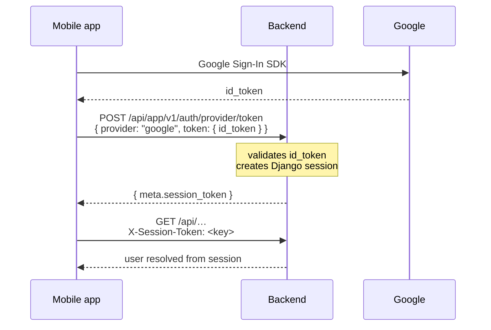
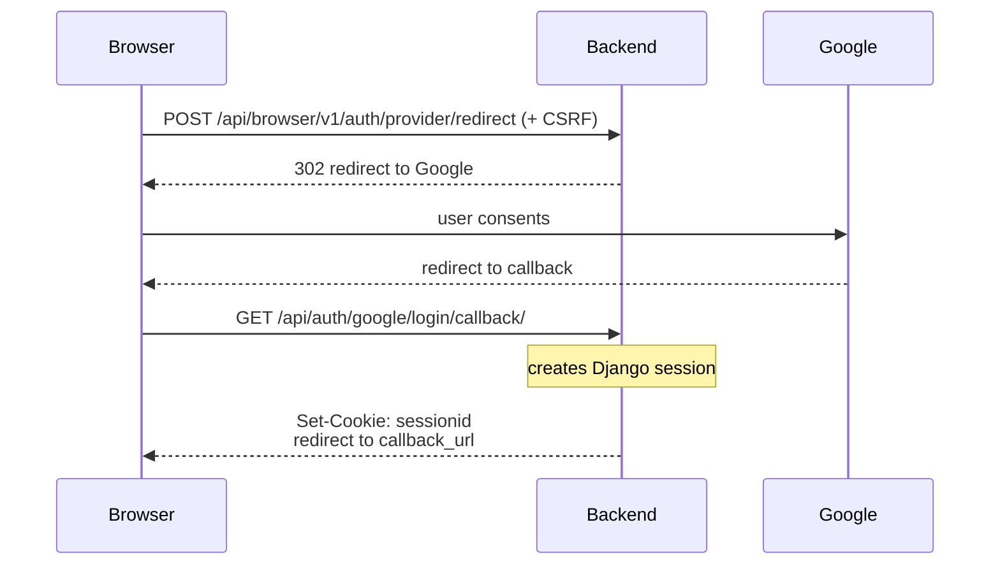

# Authentication

This page explains how authentication works in the SSI Backend: what technologies are used, how each client authenticates, and why the system is designed this way. It exists so that no contributor (including the original author 🥹️) has to reverse-engineer these decisions from settings files again.

## TL;DR

- All authentication is handled by **django-allauth** running in **headless mode** (`HEADLESS_ONLY = True`). There are no server-rendered login pages; every client talks to allauth through its JSON API.
- Every authenticated request is backed by a **standard Django session** (a row in `django_session`). There are **no JWTs** anywhere in the stack.
- Clients differ only in *how they transport* the session key:
  - **Admin panel and Web clients (Expo Web)**: standard `sessionid` cookie plus CSRF protection — identical mechanics in both cases; they differ only in *who performs the CSRF dance* (see [Cookies and CSRF: admin vs. web](#cookies-and-csrf-admin-vs-web)).
  - **Native mobile clients**: `X-Session-Token` HTTP header carrying the raw Django session key, stored in the device's secure storage.
- Login is currently **Google OAuth2 only** (see the [Self-Hosting Guide](self-hosting.md) for setup).

## What is django-allauth (headless mode)?

[django-allauth](https://docs.allauth.org/) is best known as a batteries-included authentication app for server-rendered Django. Its **headless mode** exposes the same machinery — account management, social login flows, sessions — as a pure JSON API designed for SPA and mobile clients.

In this project it is configured for two client types (`project/settings.py`):

```python
HEADLESS_ONLY = True
HEADLESS_CLIENTS = ["app", "browser"]
```

This produces two parallel sets of endpoints under `api/`:

| Client type | Endpoint prefix | Used by |
| ----------- | --------------- | ------- |
| `app` | `/api/app/v1/auth/…` | Expo native (iOS/Android) |
| `browser` | `/api/browser/v1/auth/…` | Expo Web / any browser SPA |

The split matters because the two transports authenticate differently (header vs cookie), and allauth adjusts its responses per client type.

## What is an X-Session-Token?

An `X-Session-Token` is **not** a JWT and not a custom token format. It is the **raw Django session key** — the same value that would normally live inside the `sessionid` cookie.

Native apps cannot rely on browser-managed cookies, so allauth headless supports an alternative transport for `app` clients:

1. On login, the response includes `meta.session_token`.
2. The client stores it (in this project: `expo-secure-store`) and sends it back on every request as the `X-Session-Token` header.
3. The server resolves the header back to `(user, session)` using allauth's built-in session kit (`allauth.headless.internal.sessionkit.authenticate_by_x_session_token`).

So yes — this is **allauth's default mechanism**, used out of the box. The DRF integration class (`XSessionTokenAuthentication`) also ships with allauth:

```python
REST_FRAMEWORK = {
    "DEFAULT_AUTHENTICATION_CLASSES": (
        # X-Session-Tokens for mobile ("app" clients)
        "allauth.headless.contrib.rest_framework.authentication.XSessionTokenAuthentication",
        # Cookie-based sessions for web clients ("browser") and admin
        "rest_framework.authentication.SessionAuthentication",
    ),
}
```

## Authentication flows

### Native mobile (Google ID token exchange)



Client implementation: `client-native/api/apis/authentication.ts`. The token is persisted in secure storage and re-sent on cold starts until it expires or the user logs out.

> Why the mobile app uses the **web** client ID here, and why there is no Android client ID anywhere in the code? See [Google OAuth client IDs explained](#google-oauth-client-ids-explained) below.

### Web (Google redirect flow)



The browser manages the `sessionid` cookie automatically from then on. Mutating requests must carry the CSRF token, obtained from `GET /api/auth/csrf/` (`authentication/views.py`), which is required because Django runs template-less here.

### Admin panel

Plain Django: form login, `sessionid` cookie, standard CSRF. No allauth involvement beyond staff users being normal users.

### Cookies and CSRF: admin vs. web

Admin panel and Expo Web use **the same security mechanics** — `sessionid` cookie for the session, Django's standard CSRF protection on every mutating request. Nothing about CSRF is special to the SPA path; the admin panel is CSRF-protected too.

The only difference is *who assembles the credentials*, and it exists because the admin panel is server-rendered while the SSI app is a template-less SPA:

| | Admin panel | Expo Web (SPA) |
| --- | --- | --- |
| Session | `sessionid` cookie | `sessionid` cookie (identical) |
| CSRF protection | yes | yes (identical mechanism) |
| Where the CSRF token lives | embedded into each form by the server-rendered template (``) | `csrftoken` cookie, read by JS |
| How it reaches the server | hidden form input — automatic | `X-CSRFToken` header attached by the API client |
| What a developer builds | nothing — stock Django | the `GET /api/auth/csrf/` endpoint plus client-side logic to read the cookie and send the header |

Django templates handle the whole CSRF dance invisibly for the admin panel. Headless Django renders no forms, so the SPA's code had to reproduce that dance manually — which is why the CSRF endpoint exists (`authentication/views.py`) and why the web API client attaches an anti-CSRF header to mutating requests.

#### Isn't letting JavaScript read the CSRF token a flaw?

No — CSRF tokens are deliberately *not* HttpOnly; Django ships the `csrftoken` cookie readable on purpose. The confusion mixes up two different defenses:

- **HttpOnly protects the session cookie** (ours is HttpOnly): it stops malicious scripts from exfiltrating the session key itself.
- **The CSRF token is a proof-of-read test, not a credential.** A cross-site attacker can trick the victim's browser into *sending* cookies with a forged request (that is the CSRF problem), but the Same-Origin Policy prevents them from ever *reading* those cookies. Requiring the CSRF value in a header — which only same-origin JS can produce after reading the cookie — is exactly what makes the forged request fail.

Under XSS the readability changes nothing: an attacker running script on our own origin already acts as the user (authenticated `fetch()` calls, DOM access) and gains nothing extra from the token. The real XSS defenses live elsewhere — CSP, output escaping, minimal CORS origins — while the non-negotiables here remain: `sessionid` stays HttpOnly, and `CSRF_TRUSTED_ORIGINS`/`CORS_ALLOWED_ORIGINS` stay tight.

### Real-time connections (SSE / WebSocket)

Django Channels' `AuthMiddlewareStack` authenticates WebSocket/SSE scopes via cookie, which covers web clients. Native clients instead pass `X-Session-Token`, resolved by the project's ASGI middleware (`authentication/middleware.py`), so agents' status streams authenticate identically across platforms.

## Google OAuth client IDs explained

Google sign-in involves two different OAuth clients, both registered in the same Google Cloud project. Only one of them ever appears in our code — which regularly confuses people into asking "where do we set the Android client ID?".

| OAuth client | Where it lives | Job |
| ------------ | -------------- | --- |
| **Android / iOS client** | Google Cloud console only (package name / bundle ID + signing-key fingerprint, no secret) | Authorizes *the installed app itself* to talk to Google's sign-in services. Its ID never appears in our code. |
| **Web application client** | GCP console (ID + secret), the backend's `SocialApplication` row, and the front-end environment (`EXPO_PUBLIC_GOOGLE_WEB_CLIENT_ID`) | The redirect flow for browsers, **and** the audience of native ID tokens. |

### Why does the front-end set the *web* client ID everywhere?

The client ID handed to Google Sign-In determines which client an issued ID token names as its intended audience. Because the native apps configure the SDK with the **web** client ID (`client-native/api/apis/authentication.ts`), every ID token that reaches the backend — whether produced by the mobile SDK flow or the browser redirect flow — identifies itself as belonging to the same client. The backend therefore registers exactly **one** Google client (Django admin → Social applications) and verifies all incoming tokens against it.

> In OpenID Connect terms: all tokens carry the same `aud` claim. That is the whole trick.

Had the native apps been configured with their own platform client IDs instead, mobile tokens would name one client and browser tokens another, forcing the backend to register and trust two separate Google clients for no benefit.

### Common questions

**Does the Android client exist at all, then?**

Yes. You must create it in the Google Cloud console (client type *Android*, with the app's package name and SHA-1 fingerprint), otherwise Google rejects sign-in requests coming from the installed app. But Google matches those requests by package name and fingerprint — the client ID value itself is never referenced in our code or configuration.

**Is `EXPO_PUBLIC_GOOGLE_WEB_CLIENT_ID` only used by the web build?**

No. Every platform uses it: the native sign-in configuration, the `client_id` sent in the backend token exchange, and the browser redirect flow.

## Component map

| File | Role |
| ---- | ---- |
| `project/settings.py` | `INSTALLED_APPS`, `HEADLESS_*`, `REST_FRAMEWORK`, CORS/CSRF/cookie flags |
| `authentication/adapters.py` | Custom headless adapter: adds profile picture from social account to serialized user |
| `authentication/middleware.py` | ASGI middleware resolving `X-Session-Token` for WebSocket/SSE scopes |
| `authentication/views.py` | CSRF token endpoint for headless web clients |
| `authentication/urls.py` | Mounts allauth headless URLs, Google callback, CSRF endpoint |
| `authentication/serializers.py` | User serializer used by non-allauth DRF endpoints |

## Why this design?

### Why sessions instead of JWTs?

| Concern | Sessions (chosen) | JWTs |
| ------- | ----------------- | ---- |
| Revocation ("log out everywhere", ban a user) | Immediate: delete the session row | Requires a blacklist/denylist layer, reintroducing state |
| Secret management | None on clients (opaque key) | Signing keys must be rotated/secured |
| Client complexity | Store one opaque string | Refresh tokens, expiry clocks, refresh races |
| Fit for SSI | A monitoring tool must be able to cut off access instantly | Weak fit |

JWTs buy statelessness at the cost of revocation difficulty. SSI has exactly one API consumer base and a central PostgreSQL database already in the loop on every request — there is no performance win to justify losing instant revocation.

### Why django-allauth headless instead of dj-rest-auth?

- One auth stack serves the admin panel and both API client families, instead of bolting a second library onto Django's auth.
- First-class support for social login consumed by SPAs/native apps (the ID-token exchange flow used by mobile is built-in).
- Ships its own DRF authentication class and session kit — less custom glue than wiring dj-rest-auth + a separate token scheme.

### Why not Firebase Authentication (or similar BaaS)?

Google is used here purely as an **identity provider**: it answers *"who is this person?"* via an OpenID Connect ID token, and nothing else. Every authorization decision — *can this user see, rename, or delete this agent/service?* — is made by Django against its own database (DRF permissions, ownership relations like `Agent.owner`). Delegating identity while keeping authorization local is what makes the following choices possible.

A Backend-as-a-Service identity platform was considered and rejected, in order of importance at decision time:

1. **One authentication system, not two.** A third-party identity provider would have forced a hybrid: API endpoints verifying externally issued tokens while the admin panel still runs on Django sessions — two parallel identity stores, two logout paths, two revocation stories. With allauth headless there is exactly one system (`django_session`) behind admin panel, web clients, and native clients alike.
2. **Authorization data stays home.** Roles and permissions expressed as vendor-specific custom claims would duplicate authorization state outside PostgreSQL, managed through a proprietary admin SDK instead of ordinary models and migrations. Here, permission data lives next to the resources it governs.
3. **Extensibility.** Adding email/password login (planned — see the [Self-Hosting Guide](self-hosting.md)) means adding another allauth backend, nothing more. With a BaaS provider, every additional sign-in method becomes a new integration bound to someone else's SDK and pricing.
4. **Self-hosting.** SSI ships as a docker-compose stack anyone can run. Tying identity to a cloud vendor would require every self-hosted instance to register a project there, keep its users outside the operator's own PostgreSQL (and outside the reach of the standard database backup pipeline), and add an always-on external dependency to a system whose whole job is availability monitoring.

The underlying principle: prefer the option where the fewest systems must agree, and where data lives next to the code that acts on it.

### Why two transports (cookie vs X-Session-Token)?

They solve different problems:

- **Cookies** are the correct transport in browsers: automatic, `HttpOnly`, CSRF-protected. Reinventing a header-based scheme in a browser would only lose security properties.
- **Header tokens** are the correct transport in native apps, where there is no cookie jar. allauth returns the session key explicitly and accepts it back as a header — same session, same revocation semantics, just a different envelope.

Both refer to the same underlying `django_session` row, so "who is logged in" stays a single, inspectable source of truth regardless of platform.

## Session lifecycle

- **Creation**: on successful Google login (either flow). Each login creates a new session row.
- **Validation**: every request resolves the session key → active session → user. Expired or deleted keys simply fail authentication (the client then shows the logged-out state).
- **Expiry**: managed by Django's standard session engine (`django.contrib.sessions`, database backend). No custom expiry logic exists.
- **Revocation**: deleting the `django_session` row logs that client out immediately, on every platform. Web clients trigger this via their logout call; native clients currently only discard the token locally, so the server-side session lingers until natural expiry (tracked in [ssi-client-native#11](https://github.com/RemiZlatinis/ssi-client-native/issues/11)). Per-user session listing and targeted revocation are not built yet — stock `django_session` rows carry no user reference and are not queryable (tracked in [#1](https://github.com/RemiZlatinis/ssi-backend/issues/1)).
